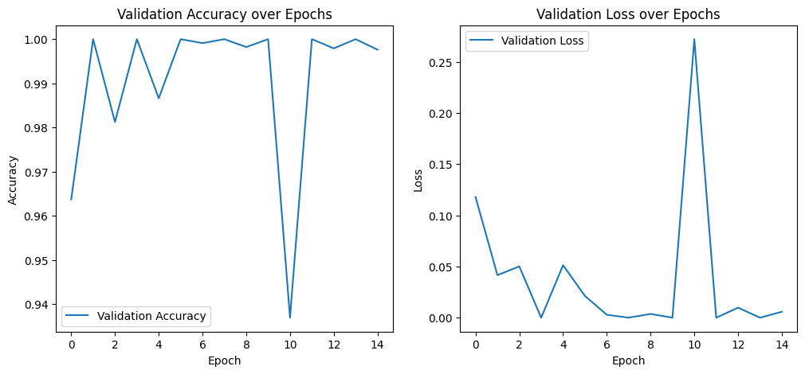

```python
import tensorflow as tf
from tensorflow.keras.models import Sequential
from tensorflow.keras.layers import Conv2D, MaxPooling2D, Flatten, Dense
from tensorflow.keras.preprocessing.image import ImageDataGenerator

```


```python
# Define the CNN model
model = Sequential([
    Conv2D(32, (3, 3), activation='relu', input_shape=(100, 100, 3)),
    MaxPooling2D(pool_size=(2, 2)),
    
    Conv2D(64, (3, 3), activation='relu'),
    MaxPooling2D(pool_size=(2, 2)),
    
    Conv2D(128, (3, 3), activation='relu'),
    MaxPooling2D(pool_size=(2, 2)),
    
    Flatten(),
    Dense(128, activation='relu'),
    Dense(33, activation='softmax')  # 33 classes for 33 fruits and vegetables
])

model.summary()
```


<pre style="white-space:pre;overflow-x:auto;line-height:normal;font-family:Menlo,'DejaVu Sans Mono',consolas,'Courier New',monospace"><span style="font-weight: bold">Model: "sequential_4"</span>
</pre>


<pre style="white-space:pre;overflow-x:auto;line-height:normal;font-family:Menlo,'DejaVu Sans Mono',consolas,'Courier New',monospace">┏━━━━━━━━━━━━━━━━━━━━━━━━━━━━━━━━━┳━━━━━━━━━━━━━━━━━━━━━━━━┳━━━━━━━━━━━━━━━┓
┃<span style="font-weight: bold"> Layer (type)                    </span>┃<span style="font-weight: bold"> Output Shape           </span>┃<span style="font-weight: bold">       Param # </span>┃
┡━━━━━━━━━━━━━━━━━━━━━━━━━━━━━━━━━╇━━━━━━━━━━━━━━━━━━━━━━━━╇━━━━━━━━━━━━━━━┩
│ conv2d_12 (<span style="color: #0087ff; text-decoration-color: #0087ff">Conv2D</span>)              │ (<span style="color: #00d7ff; text-decoration-color: #00d7ff">None</span>, <span style="color: #00af00; text-decoration-color: #00af00">98</span>, <span style="color: #00af00; text-decoration-color: #00af00">98</span>, <span style="color: #00af00; text-decoration-color: #00af00">32</span>)     │           <span style="color: #00af00; text-decoration-color: #00af00">896</span> │
├─────────────────────────────────┼────────────────────────┼───────────────┤
│ max_pooling2d_12 (<span style="color: #0087ff; text-decoration-color: #0087ff">MaxPooling2D</span>) │ (<span style="color: #00d7ff; text-decoration-color: #00d7ff">None</span>, <span style="color: #00af00; text-decoration-color: #00af00">49</span>, <span style="color: #00af00; text-decoration-color: #00af00">49</span>, <span style="color: #00af00; text-decoration-color: #00af00">32</span>)     │             <span style="color: #00af00; text-decoration-color: #00af00">0</span> │
├─────────────────────────────────┼────────────────────────┼───────────────┤
│ conv2d_13 (<span style="color: #0087ff; text-decoration-color: #0087ff">Conv2D</span>)              │ (<span style="color: #00d7ff; text-decoration-color: #00d7ff">None</span>, <span style="color: #00af00; text-decoration-color: #00af00">47</span>, <span style="color: #00af00; text-decoration-color: #00af00">47</span>, <span style="color: #00af00; text-decoration-color: #00af00">64</span>)     │        <span style="color: #00af00; text-decoration-color: #00af00">18,496</span> │
├─────────────────────────────────┼────────────────────────┼───────────────┤
│ max_pooling2d_13 (<span style="color: #0087ff; text-decoration-color: #0087ff">MaxPooling2D</span>) │ (<span style="color: #00d7ff; text-decoration-color: #00d7ff">None</span>, <span style="color: #00af00; text-decoration-color: #00af00">23</span>, <span style="color: #00af00; text-decoration-color: #00af00">23</span>, <span style="color: #00af00; text-decoration-color: #00af00">64</span>)     │             <span style="color: #00af00; text-decoration-color: #00af00">0</span> │
├─────────────────────────────────┼────────────────────────┼───────────────┤
│ conv2d_14 (<span style="color: #0087ff; text-decoration-color: #0087ff">Conv2D</span>)              │ (<span style="color: #00d7ff; text-decoration-color: #00d7ff">None</span>, <span style="color: #00af00; text-decoration-color: #00af00">21</span>, <span style="color: #00af00; text-decoration-color: #00af00">21</span>, <span style="color: #00af00; text-decoration-color: #00af00">128</span>)    │        <span style="color: #00af00; text-decoration-color: #00af00">73,856</span> │
├─────────────────────────────────┼────────────────────────┼───────────────┤
│ max_pooling2d_14 (<span style="color: #0087ff; text-decoration-color: #0087ff">MaxPooling2D</span>) │ (<span style="color: #00d7ff; text-decoration-color: #00d7ff">None</span>, <span style="color: #00af00; text-decoration-color: #00af00">10</span>, <span style="color: #00af00; text-decoration-color: #00af00">10</span>, <span style="color: #00af00; text-decoration-color: #00af00">128</span>)    │             <span style="color: #00af00; text-decoration-color: #00af00">0</span> │
├─────────────────────────────────┼────────────────────────┼───────────────┤
│ flatten_4 (<span style="color: #0087ff; text-decoration-color: #0087ff">Flatten</span>)             │ (<span style="color: #00d7ff; text-decoration-color: #00d7ff">None</span>, <span style="color: #00af00; text-decoration-color: #00af00">12800</span>)          │             <span style="color: #00af00; text-decoration-color: #00af00">0</span> │
├─────────────────────────────────┼────────────────────────┼───────────────┤
│ dense_8 (<span style="color: #0087ff; text-decoration-color: #0087ff">Dense</span>)                 │ (<span style="color: #00d7ff; text-decoration-color: #00d7ff">None</span>, <span style="color: #00af00; text-decoration-color: #00af00">128</span>)            │     <span style="color: #00af00; text-decoration-color: #00af00">1,638,528</span> │
├─────────────────────────────────┼────────────────────────┼───────────────┤
│ dense_9 (<span style="color: #0087ff; text-decoration-color: #0087ff">Dense</span>)                 │ (<span style="color: #00d7ff; text-decoration-color: #00d7ff">None</span>, <span style="color: #00af00; text-decoration-color: #00af00">33</span>)             │         <span style="color: #00af00; text-decoration-color: #00af00">4,257</span> │
└─────────────────────────────────┴────────────────────────┴───────────────┘
</pre>


<pre style="white-space:pre;overflow-x:auto;line-height:normal;font-family:Menlo,'DejaVu Sans Mono',consolas,'Courier New',monospace"><span style="font-weight: bold"> Total params: </span><span style="color: #00af00; text-decoration-color: #00af00">1,736,033</span> (6.62 MB)
</pre>


<pre style="white-space:pre;overflow-x:auto;line-height:normal;font-family:Menlo,'DejaVu Sans Mono',consolas,'Courier New',monospace"><span style="font-weight: bold"> Trainable params: </span><span style="color: #00af00; text-decoration-color: #00af00">1,736,033</span> (6.62 MB)
</pre>


<pre style="white-space:pre;overflow-x:auto;line-height:normal;font-family:Menlo,'DejaVu Sans Mono',consolas,'Courier New',monospace"><span style="font-weight: bold"> Non-trainable params: </span><span style="color: #00af00; text-decoration-color: #00af00">0</span> (0.00 B)
</pre>


```python
# Compile the model
model.compile(optimizer='adam', loss='categorical_crossentropy', metrics=['accuracy'])

# Image data generators for training and validation
train_datagen = ImageDataGenerator(
    rescale=1./255,
    shear_range=0.2,
    zoom_range=0.2,
    horizontal_flip=True,
    validation_split=0.2  # Use 20% of the data for validation
)

# Create training and validation data generators
train_generator = train_datagen.flow_from_directory(
    '/kaggle/input/fruit-recognition/train/train',
    target_size=(100, 100),
    batch_size=32,
    class_mode='categorical',
    subset='training'  # Set as training data
)

validation_generator = train_datagen.flow_from_directory(
    '/kaggle/input/fruit-recognition/train/train',  # Same directory as training data
    target_size=(100, 100),
    batch_size=32,
    class_mode='categorical',
    subset='validation'  # Set as validation data
)
```

    Found 13493 images belonging to 33 classes.
    Found 3361 images belonging to 33 classes.
    


```python
# Print class indices to verify correct setup
print("Class Indices:")
print(train_generator.class_indices)
print(validation_generator.class_indices)

# Check the shapes of data coming from the generators
x_train, y_train = next(train_generator)
x_val, y_val = next(validation_generator)

print("Shape of training data:", x_train.shape, y_train.shape)
print("Shape of validation data:", x_val.shape, y_val.shape)

# Train the model
history = model.fit(
    train_generator,
    steps_per_epoch=train_generator.samples // train_generator.batch_size,
    validation_data=validation_generator,
    validation_steps=validation_generator.samples // validation_generator.batch_size,
    epochs=15
)
```

    Class Indices:
    {'Apple Braeburn': 0, 'Apple Granny Smith': 1, 'Apricot': 2, 'Avocado': 3, 'Banana': 4, 'Blueberry': 5, 'Cactus fruit': 6, 'Cantaloupe': 7, 'Cherry': 8, 'Clementine': 9, 'Corn': 10, 'Cucumber Ripe': 11, 'Grape Blue': 12, 'Kiwi': 13, 'Lemon': 14, 'Limes': 15, 'Mango': 16, 'Onion White': 17, 'Orange': 18, 'Papaya': 19, 'Passion Fruit': 20, 'Peach': 21, 'Pear': 22, 'Pepper Green': 23, 'Pepper Red': 24, 'Pineapple': 25, 'Plum': 26, 'Pomegranate': 27, 'Potato Red': 28, 'Raspberry': 29, 'Strawberry': 30, 'Tomato': 31, 'Watermelon': 32}
    {'Apple Braeburn': 0, 'Apple Granny Smith': 1, 'Apricot': 2, 'Avocado': 3, 'Banana': 4, 'Blueberry': 5, 'Cactus fruit': 6, 'Cantaloupe': 7, 'Cherry': 8, 'Clementine': 9, 'Corn': 10, 'Cucumber Ripe': 11, 'Grape Blue': 12, 'Kiwi': 13, 'Lemon': 14, 'Limes': 15, 'Mango': 16, 'Onion White': 17, 'Orange': 18, 'Papaya': 19, 'Passion Fruit': 20, 'Peach': 21, 'Pear': 22, 'Pepper Green': 23, 'Pepper Red': 24, 'Pineapple': 25, 'Plum': 26, 'Pomegranate': 27, 'Potato Red': 28, 'Raspberry': 29, 'Strawberry': 30, 'Tomato': 31, 'Watermelon': 32}
    Shape of training data: (32, 100, 100, 3) (32, 33)
    Shape of validation data: (32, 100, 100, 3) (32, 33)
    Epoch 1/15
    

    /opt/conda/lib/python3.10/site-packages/keras/src/trainers/data_adapters/py_dataset_adapter.py:121: UserWarning: Your `PyDataset` class should call `super().__init__(**kwargs)` in its constructor. `**kwargs` can include `workers`, `use_multiprocessing`, `max_queue_size`. Do not pass these arguments to `fit()`, as they will be ignored.
      self._warn_if_super_not_called()
    

    421/421 ━━━━━━━━━━━━━━━━━━━━ 173s 403ms/step - accuracy: 0.6223 - loss: 1.2854 - val_accuracy: 0.9637 - val_loss: 0.1179
    Epoch 2/15
    421/421 ━━━━━━━━━━━━━━━━━━━━ 0s 96us/step - accuracy: 0.9375 - loss: 0.1535 - val_accuracy: 1.0000 - val_loss: 0.0416
    Epoch 3/15
    

    /opt/conda/lib/python3.10/contextlib.py:153: UserWarning: Your input ran out of data; interrupting training. Make sure that your dataset or generator can generate at least `steps_per_epoch * epochs` batches. You may need to use the `.repeat()` function when building your dataset.
      self.gen.throw(typ, value, traceback)
    

    421/421 ━━━━━━━━━━━━━━━━━━━━ 156s 369ms/step - accuracy: 0.9826 - loss: 0.0632 - val_accuracy: 0.9812 - val_loss: 0.0501
    Epoch 4/15
    421/421 ━━━━━━━━━━━━━━━━━━━━ 16s 38ms/step - accuracy: 1.0000 - loss: 0.0200 - val_accuracy: 1.0000 - val_loss: 2.0266e-06
    Epoch 5/15
    421/421 ━━━━━━━━━━━━━━━━━━━━ 150s 355ms/step - accuracy: 0.9923 - loss: 0.0246 - val_accuracy: 0.9866 - val_loss: 0.0513
    Epoch 6/15
    421/421 ━━━━━━━━━━━━━━━━━━━━ 0s 53us/step - accuracy: 0.9688 - loss: 0.0414 - val_accuracy: 1.0000 - val_loss: 0.0212
    Epoch 7/15
    421/421 ━━━━━━━━━━━━━━━━━━━━ 150s 355ms/step - accuracy: 0.9844 - loss: 0.0554 - val_accuracy: 0.9991 - val_loss: 0.0028
    Epoch 8/15
    421/421 ━━━━━━━━━━━━━━━━━━━━ 0s 58us/step - accuracy: 1.0000 - loss: 8.2799e-04 - val_accuracy: 1.0000 - val_loss: 1.4782e-05
    Epoch 9/15
    421/421 ━━━━━━━━━━━━━━━━━━━━ 150s 355ms/step - accuracy: 0.9918 - loss: 0.0307 - val_accuracy: 0.9982 - val_loss: 0.0037
    Epoch 10/15
    421/421 ━━━━━━━━━━━━━━━━━━━━ 0s 63us/step - accuracy: 1.0000 - loss: 2.8573e-04 - val_accuracy: 1.0000 - val_loss: 8.3446e-06
    Epoch 11/15
    421/421 ━━━━━━━━━━━━━━━━━━━━ 148s 350ms/step - accuracy: 0.9987 - loss: 0.0048 - val_accuracy: 0.9369 - val_loss: 0.2721
    Epoch 12/15
    421/421 ━━━━━━━━━━━━━━━━━━━━ 0s 68us/step - accuracy: 0.8750 - loss: 0.6209 - val_accuracy: 1.0000 - val_loss: 1.1921e-06
    Epoch 13/15
    421/421 ━━━━━━━━━━━━━━━━━━━━ 149s 352ms/step - accuracy: 0.9866 - loss: 0.0467 - val_accuracy: 0.9979 - val_loss: 0.0098
    Epoch 14/15
    421/421 ━━━━━━━━━━━━━━━━━━━━ 3s 6ms/step - accuracy: 1.0000 - loss: 0.0026 - val_accuracy: 1.0000 - val_loss: 0.0000e+00
    Epoch 15/15
    421/421 ━━━━━━━━━━━━━━━━━━━━ 150s 355ms/step - accuracy: 0.9921 - loss: 0.0293 - val_accuracy: 0.9976 - val_loss: 0.0058
    


```python
# Evaluate the model on the validation data
val_loss, val_accuracy = model.evaluate(validation_generator)
print(f'Validation Loss: {val_loss}')
print(f'Validation Accuracy: {val_accuracy}')

# Save the model
model.save('fruit_classifier_cnn.h5')
```

    106/106 ━━━━━━━━━━━━━━━━━━━━ 18s 173ms/step - accuracy: 0.9994 - loss: 0.0027
    Validation Loss: 0.0038489773869514465
    Validation Accuracy: 0.9991074204444885
    


```python
import matplotlib as plt
```


```python
import matplotlib.pyplot as plt

# Plot validation loss
plt.figure(figsize=(12, 5))

# Plot validation accuracy
plt.subplot(1, 2, 1)
plt.plot(history.history['val_accuracy'], label='Validation Accuracy')
plt.xlabel('Epoch')
plt.ylabel('Accuracy')
plt.legend()
plt.title('Validation Accuracy over Epochs')

# Plot validation loss
plt.subplot(1, 2, 2)
plt.plot(history.history['val_loss'], label='Validation Loss')
plt.xlabel('Epoch')
plt.ylabel('Loss')
plt.legend()
plt.title('Validation Loss over Epochs')

plt.show()

```


    

    

